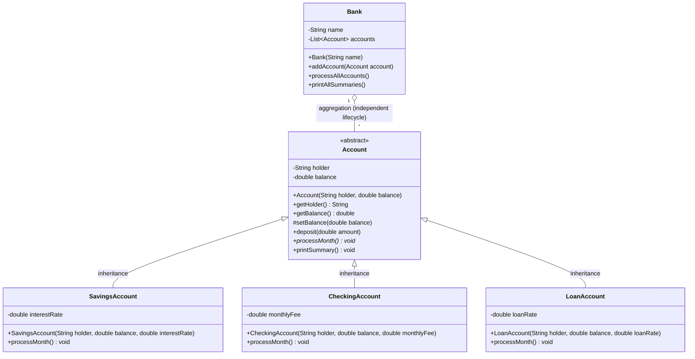

# Lexicon Bank  

```mermaid
classDiagram
    class Bank {
        -String name
        -List~Account~ accounts
        +Bank(String name)
        +addAccount(Account account)
        +processAllAccounts()
        +printAllSummaries()
    }

    class Account {
        <<abstract>>
        -String holder
        -double balance
        +Account(String holder, double balance)
        +getHolder() String
        +getBalance() double
        #setBalance(double balance)
        +deposit(double amount)
        +processMonth()* void
        +printSummary() void
    }

    class SavingsAccount {
        -double interestRate
        +SavingsAccount(String holder, double balance, double interestRate)
        +processMonth() void
    }

    class CheckingAccount {
        -double monthlyFee
        +CheckingAccount(String holder, double balance, double monthlyFee)
        +processMonth() void
    }

    class LoanAccount {
        -double loanRate
        +LoanAccount(String holder, double balance, double loanRate)
        +processMonth() void
    }

    %% Relationships
    Bank "1" o-- "*" Account : aggregation (independent lifecycle)
    Account <|-- SavingsAccount : inheritance
    Account <|-- CheckingAccount : inheritance
    Account <|-- LoanAccount : inheritance
```