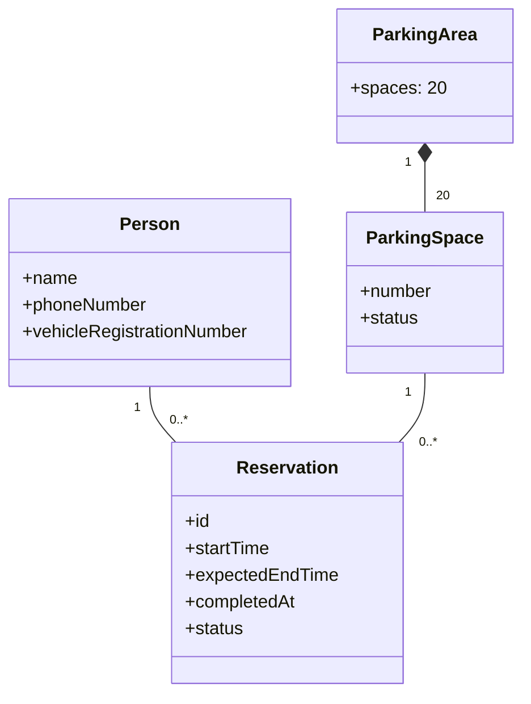
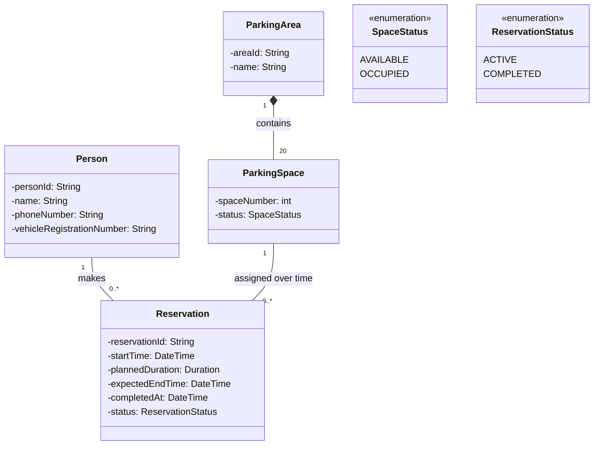

#  LEXICON PARKING SYSTEM

# Domain Model

```mermaid
classDiagram
ParkingArea "1" *-- "20" ParkingSpace
Person "1" -- "0..*" Reservation
ParkingSpace "1" -- "0..*" Reservation

    class ParkingArea {
        +spaces: 20
    }

    class ParkingSpace {
        +number
        +status
    }

    class Person {
        +name
        +phoneNumber
        +vehicleRegistrationNumber
    }

    class Reservation {
        +id
        +startTime
        +expectedEndTime
        +completedAt
        +status
    }
```
# UML Class Diagram

```mermaid
classDiagram
class ParkingArea {
-areaId: String
-name: String
}

    class ParkingSpace {
        -spaceNumber: int
        -status: SpaceStatus
    }

    class Person {
        -personId: String
        -name: String
        -phoneNumber: String
        -vehicleRegistrationNumber: String
    }

    class Reservation {
        -reservationId: String
        -startTime: DateTime
        -plannedDuration: Duration
        -expectedEndTime: DateTime
        -completedAt: DateTime
        -status: ReservationStatus
    }

    class SpaceStatus {
        <<enumeration>>
        AVAILABLE
        OCCUPIED
    }

    class ReservationStatus {
        <<enumeration>>
        ACTIVE
        COMPLETED
    }

    ParkingArea "1" *-- "20" ParkingSpace : contains
    Person "1" -- "0..*" Reservation : makes
    ParkingSpace "1" -- "0..*" Reservation : assigned over time
```