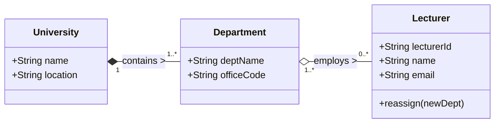
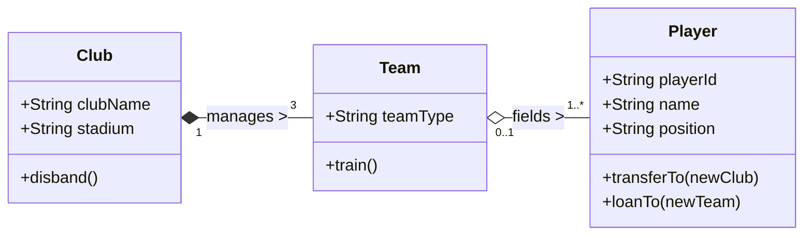
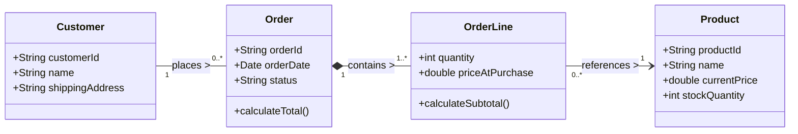

# University Departments

```mermaid
classDiagram
    direction LR
    
    class University {
        +String name
        +String location
    }
    
    class Department {
        +String deptName
        +String officeCode
    }
    
    class Lecturer {
        +String lecturerId
        +String name
        +String email
        +reassign(newDept)
    }

    %% Relationships with Multiplicity
    %% "1" University owns "1..*" Departments (Filled diamond on University side)
    University "1" *-- "1..*" Department : contains >
    
    %% "1..*" Departments have "0..*" Lecturers (Hollow diamond on Department side)
    Department "1..*" o-- "0..*" Lecturer : employs >
```

# Sports Club

```mermaid
classDiagram
    direction LR
    
    class Club {
        +String clubName
        +String stadium
        +disband()
    }
    
    class Team {
        +String teamType
        +train()
    }
    
    class Player {
        +String playerId
        +String name
        +String position
        +transferTo(newClub)
        +loanTo(newTeam)
    }

    %% Relationships with Multiplicity
    %% "1" Club owns exactly "3" Teams (Filled diamond on Club side)
    Club "1" *-- "3" Team : manages >
    
    %% "0..1" Team has "1..*" Players (Hollow diamond on Team side)
    Team "0..1" o-- "1..*" Player : fields >

```

# Customer Orders

```mermaid
classDiagram
    direction LR
    
    class Customer {
        +String customerId
        +String name
        +String shippingAddress
    }
    
    class Order {
        +String orderId
        +Date orderDate
        +String status
        +calculateTotal()
    }
    
    class OrderLine {
        +int quantity
        +double priceAtPurchase
        +calculateSubtotal()
    }
    
    class Product {
        +String productId
        +String name
        +double currentPrice
        +int stockQuantity
    }

    %% Relationships with Multiplicity
    %% "1" Customer places "0..*" Orders
    Customer "1" -- "0..*" Order : places >
    
    %% "1" Order explicitly owns "1..*" OrderLines (Filled diamond on Order side)
    Order "1" *-- "1..*" OrderLine : contains >
    
    %% "1" OrderLine references "1" Product
    OrderLine "0..*" --> "1" Product : references >
```